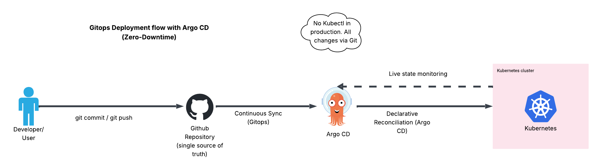
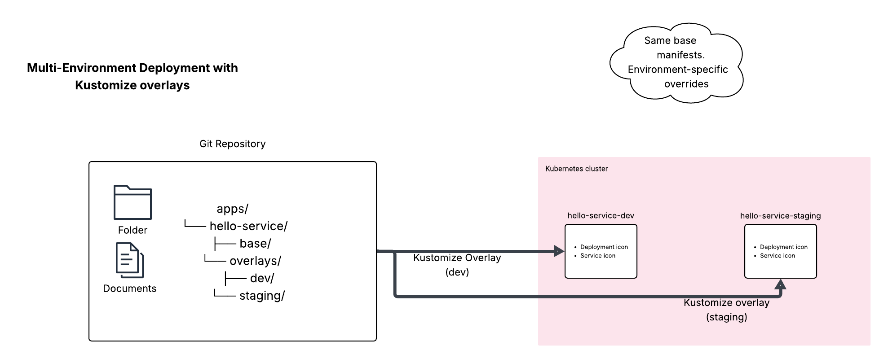
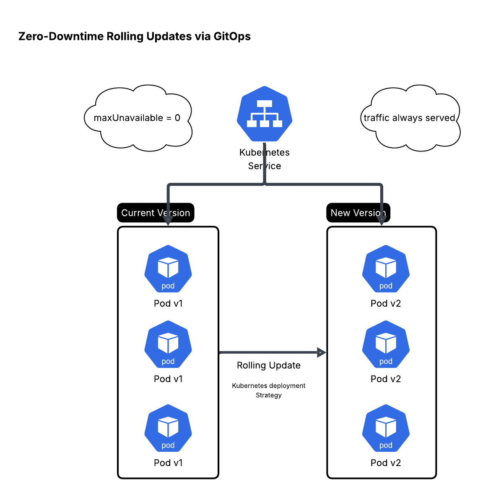

# Zero-Downtime GitOps Platform on GKE Autopilot (Argo CD + Kustomize)

## Overview
This repository implements a **production-style GitOps delivery workflow** on **Google Kubernetes Engine (GKE) Autopilot** using **Argo CD** and **Kustomize**.

All application changes are delivered **declaratively via Git** (single source of truth), enabling **repeatable, auditable, and zero-downtime** deployments across multiple environments.

## Architecture
### GitOps Control Flow


### Multi-Environment Deployment


### Zero-Downtime Rollouts


## Key Concepts Demonstrated
- GitOps with Argo CD as the reconciliation engine (Git = source of truth)
- Environment separation using Kustomize overlays (`dev`, `staging`)
- Rolling updates designed for zero-downtime service continuity
- Declarative Kubernetes management (no manual drift)
- Separation of concerns: platform components vs application workloads

## Repository Structure
```text
apps/
  hello-service/
    base/
    overlays/
      dev/
      staging/
screenshots/
  argocd/
  gke/
  app/
diagrams/
README.md
---

## Deployment Flow
1. A change is committed to GitHub (desired state updated)
2. Argo CD detects the change and compares desired vs live state
3. Argo CD applies the change to the cluster and continuously reconciles drift
4. Kubernetes performs rolling updates to keep traffic served throughout

## Environments
- **dev** – rapid iteration and validation
- **staging** – production-like validation before release

## Technology Stack
- **GKE Autopilot** (managed Kubernetes control plane + node lifecycle)
- **Argo CD** (GitOps continuous reconciliation)
- **Kustomize** (base + overlays for environment-specific configuration)
- **GitHub** (source control / single source of truth)
- **Docker

## Future Improvements
- Deploy platform to Google Kubernetes Engine (GKE)
- Provision infrastructure using Terraform
- Add monitoring and alerting (Prometheus & Grafana)


## GitOps Deployment Proof

### Argo CD Applications


### GKE Autopilot Workloads (Console)


### Application Deployments (Console)


### App Output


