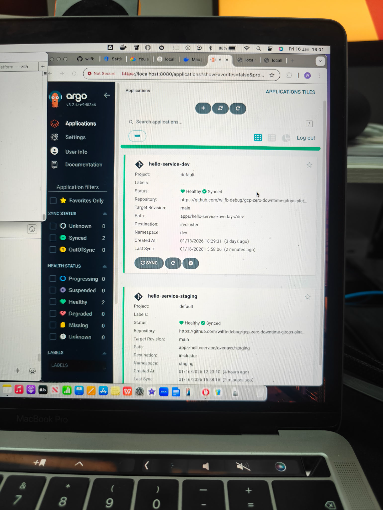
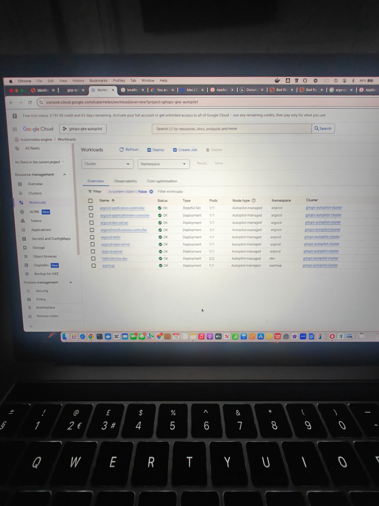
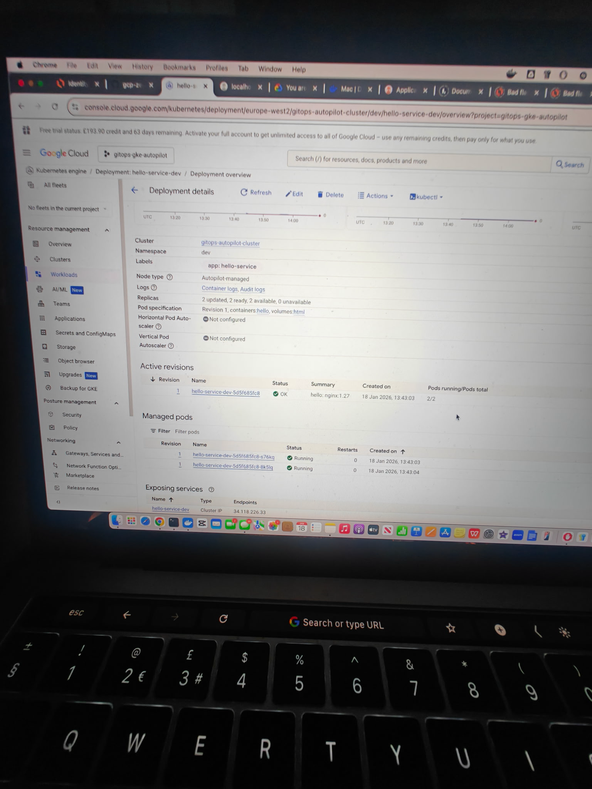
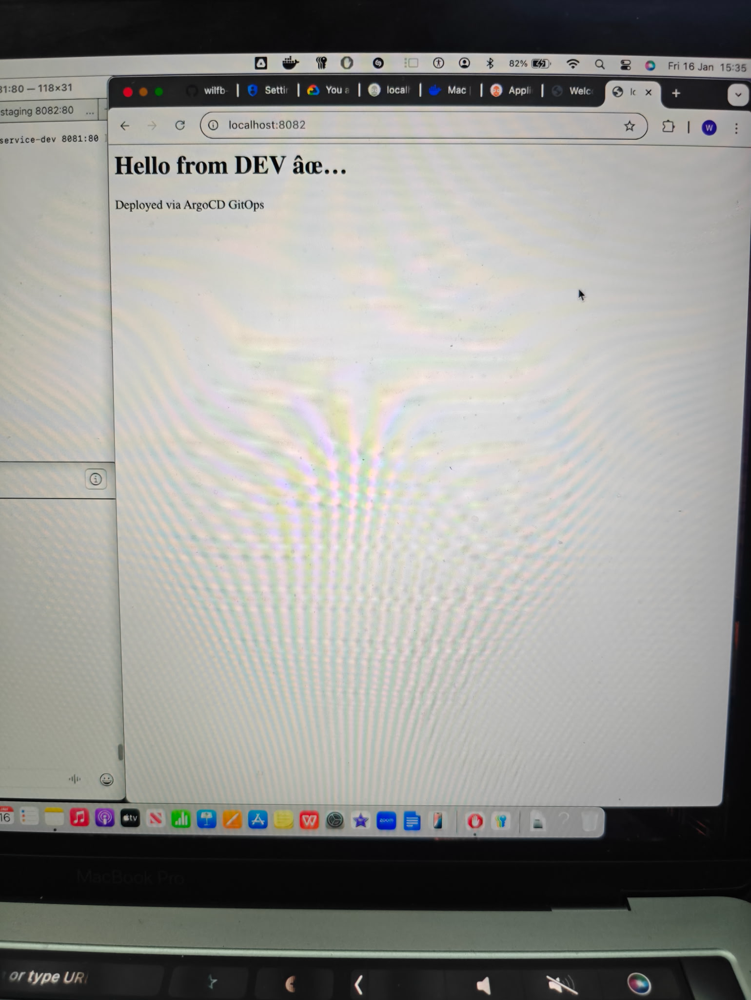
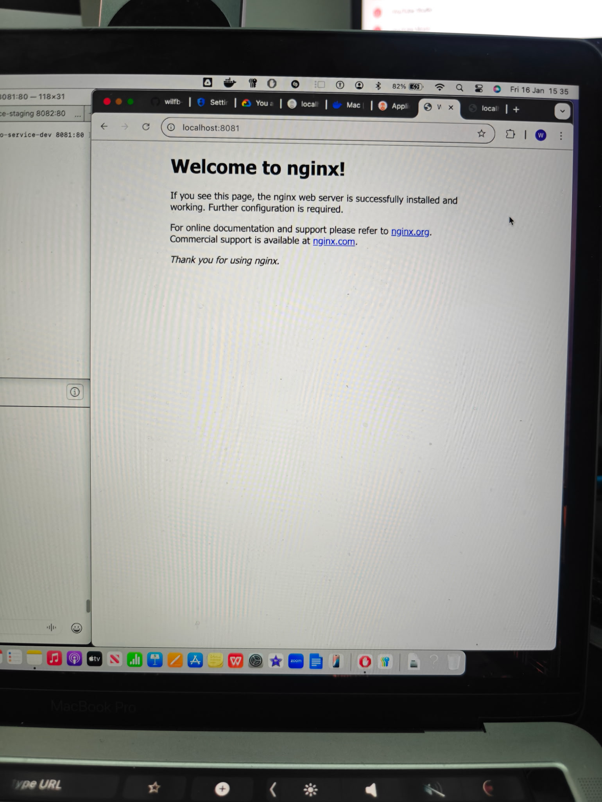

# gcp-zero-downtime-gitops-platform
# Zero-Downtime GitOps Platform on Kubernetes

## Overview
This project demonstrates a production-grade GitOps deployment platform using Argo CD and Kubernetes.  
All application changes are delivered declaratively via Git, enabling safe, auditable, and zero-downtime deployments across multiple environments.

## Architecture
### GitOps Control Flow

### Multi-Environment Deployment

### Zero-Downtime Rollouts

## Key Concepts Demonstrated
- GitOps with Argo CD (single source of truth)
- Environment separation using Kustomize overlays
- Zero-downtime rolling deployments
- Declarative Kubernetes management
- No direct kubectl access in production

## Repository Structure

## Deployment Flow
1. Developer pushes changes to GitHub
2. Argo CD continuously reconciles cluster state
3. Kubernetes performs rolling updates with no downtime
4. Service ensures traffic is always served

## Environments
- **dev** – rapid iteration and validation
- **staging** – production-like validation before release

## Technologies Used
- Kubernetes
- Argo CD
- Kustomize
- GitHub
- Docker

## Future Improvements
- Deploy platform to Google Kubernetes Engine (GKE)
- Provision infrastructure using Terraform
- Add monitoring and alerting (Prometheus & Grafana)

## GitOps Deployment Proof

### ArgoCD Applications (Dev & Staging)

### GKE Autopilot Workloads

### hello-service (dev)

## Proof (GitOps in action)

### ArgoCD

### App output

